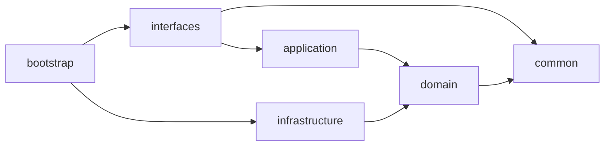

# Auth Center

本文档定义 Auth Center 服务的开发规范。

## 项目概述

auth-center 是 ArchAIHarness 多租户 SaaS 内核的认证中心，提供访问令牌管理、OAuth 2.0 授权码流程、SSO 单点登录能力。

基于 DDD 分层架构 + Spring Boot 3.3 + Maven 多模块构建。

## 模块结构



| 模块 | 职责 | 依赖 |
|---|---|---|
| `common` | 共享内核，纯 Java，零框架依赖 | 无 |
| `domain` | 领域模型、仓储接口、领域服务接口 | common |
| `application` | 用例编排、DTO | domain |
| `infrastructure` | JPA 持久化、Feign 客户端、JWT 实现 | domain |
| `interfaces` | Controller、Filter、全局异常处理、响应包装 | application, common |
| `bootstrap` | 启动入口、配置文件 | interfaces, infrastructure |

当前实现根包名：`top.cloudlab.auth`。公开复用时可按组织规范迁移。

## 核心领域

| 上下文 | 说明 |
|---|---|
| AccessToken | 访问令牌聚合根，HMAC-SHA512 签名 |
| AuthCode | OAuth 授权码聚合根，一次性使用 |
| AccessSecret | AK/SK 值对象，支持 HMAC-SHA256 签名验证 |

## API 端点

| 方法 | 路径 | 认证 | 说明 |
|---|---|---|---|
| GET | `/` | 否 | 验证访问令牌 |
| POST | `/token` | 否 | AK/SK 创建令牌 |
| POST | `/refresh_token` | 是 | 刷新令牌 |
| GET | `/userinfo` | 是 | 获取用户信息 |
| POST | `/oauth/authorize` | 是 | 生成授权码 |
| POST | `/oauth/access_token` | 否 | 授权码换令牌 |
| GET | `/sso/login` | 否 | SSO 登录 |

## 上下文传播

所有 Header 名称必须为全小写，禁止 `X-User-Id` 等大小写变体。

| Header | 说明 |
|---|---|
| `x-trace-id` | 链路追踪 ID |
| `x-tenant-id` | 当前租户 ID |
| `x-user-id` | 当前用户 ID |
| `x-tenant-ids` | 可访问租户集合 |

## 红线规则 [P0]

### SSO Cookie 写入方式

禁止使用 Servlet `response.addCookie()` 写 SSO Cookie，必须用 JavaScript `document.cookie`。

| 正确 | 禁止 |
|---|---|
| HTML 响应里嵌入 `<script>document.cookie = '...; domain=.example.com; ...'</script>` | `Cookie c = new Cookie(...); c.setDomain(".example.com"); response.addCookie(c);` |

原因：Tomcat 9.0.58+ `Rfc6265CookieProcessor` 会拒绝 `.example.com` 前导点；JS `document.cookie` 绕过服务端 Cookie API 校验，由浏览器处理跨子域 cookie。

详见：[`docs/adr/0001-sso-cookie-via-js.md`](docs/adr/0001-sso-cookie-via-js.md)

自检：`SSOController.java` 中如果出现 `import jakarta.servlet.http.Cookie;` 或 `response.addCookie(`，立即驳回。

## 外部服务依赖

| 服务 | 用途 |
|---|---|
| user-center | AK/SK 校验、用户信息查询 |
| external SSO provider | SSO 登录 |

## 数据库规范

所有表必须包含公共字段：

```sql
`id` BIGINT NOT NULL AUTO_INCREMENT COMMENT '自增主键',
`create_time` DATETIME DEFAULT CURRENT_TIMESTAMP COMMENT '创建时间',
`modify_time` DATETIME DEFAULT CURRENT_TIMESTAMP ON UPDATE CURRENT_TIMESTAMP COMMENT '修改时间',
`deleted` TINYINT(1) DEFAULT 0 COMMENT '是否删除，0否1是',
`version` INT DEFAULT 0 COMMENT '乐观锁版本号'
```

业务主键字段使用语义 ID 和唯一索引，例如：

```sql
`token_id` VARCHAR(50) NOT NULL COMMENT '令牌ID',
UNIQUE KEY `uk_token_id` (`token_id`)
```

## 分层规范

### Common 层

零框架依赖，禁止引入 Spring/JPA/Kafka/Redis。

### Domain 层

只包含领域模型、仓储接口和值对象；禁止引入 `org.springframework.*` 注解。

### Application 层

只做用例编排；禁止依赖 infrastructure 或 interfaces；Response 不引用领域实体。

### Infrastructure 层

只实现持久化、Feign、JWT 等技术细节；Entity 不得暴露到其他层。

### Interfaces 层

只处理 Controller、Filter、异常处理；禁止直接注入 Repository。

### Bootstrap 层

只负责启动和装配；禁止显式指定包扫描路径。

## 验证命令

```bash
mvn clean compile
mvn clean test
mvn clean package
```
