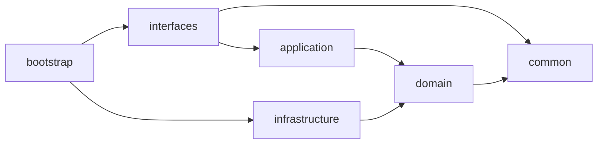

# Auth Center

本文档定义 Auth Center 服务的开发规范。

---

## 项目概述

auth-center 是云燕平台的认证中心，提供访问令牌管理、OAuth 2.0 授权码流程、SSO 单点登录三大核心能力。

基于 DDD 分层架构 + Spring Boot 3.3 + Maven 多模块构建。

### 模块结构



| 模块 | 职责 | 依赖 |
|---|---|---|
| `common` | 共享内核，纯 Java，零框架依赖 | 无 |
| `domain` | 领域模型、仓储接口、领域服务接口 | common |
| `application` | 用例编排、DTO（Command/Query/Response） | domain |
| `infrastructure` | JPA 持久化、Feign 客户端、JWT 实现 | domain |
| `interfaces` | Controller、Filter、全局异常处理、响应包装 | application, common |
| `bootstrap` | 启动入口、配置文件 | interfaces, infrastructure |

### 包命名规范

根包名：`top.cloudlab.auth`

| 模块 | 包路径 |
|---|---|
| common | `top.cloudlab.auth.common.*` |
| domain | `top.cloudlab.auth.domain.*` |
| application | `top.cloudlab.auth.application.*` |
| infrastructure | `top.cloudlab.auth.infrastructure.*` |
| interfaces | `top.cloudlab.auth.interfaces.*` |

### 技术栈

| 技术 | 版本 |
|---|---|
| Java | 17 |
| Spring Boot | 3.3.5 |
| Spring Cloud | 2023.0.3 |
| MySQL | 8.x |
| auth0 java-jwt | 4.4.0 |
| Lombok | 1.18.28 |

---

## 核心业务领域

### 访问令牌 (AccessToken)

- 聚合根，继承 `AggregateRoot`
- 工厂方法：`create()` / `reconstruct()`
- JWT 签名算法：HMAC-SHA512

### 授权码 (AuthCode)

- 聚合根，一次性使用
- 默认有效期 600 秒

### 用户密钥 (AccessSecret)

- 值对象 (record)
- AK/SK 对，支持 HMAC-SHA256 签名验证

---

## API 端点

| 方法 | 路径 | 认证 | 说明 |
|---|---|---|---|
| GET | `/` | 否 | 验证访问令牌 |
| POST | `/token` | 否 | AK/SK 创建令牌 |
| POST | `/refresh_token` | 是 | 刷新令牌 |
| GET | `/userinfo` | 是 | 获取用户信息 |
| POST | `/oauth/authorize` | 是 | 生成授权码 |
| POST | `/oauth/access_token` | 否 | 授权码换令牌 |
| GET | `/sso/login` | 否 | SSO 登录 |

### Token 创建

```json
POST /token
{
  "ak": "xxx",
  "sk": "xxx",
  "tenantId": "16645192323286622080"  // 可选
}
```

---

## 上下文传播

> **强约束 [P0]**：所有 Header 名称必须为**全小写**，禁止 `X-User-Id` 等大小写变体。

- `AppContext`：ThreadLocal 存储请求头（`x-trace-id`、`x-tenant-id`、`x-user-id`）
- `FeignRequestInterceptor`：ThreadLocal → Feign 调用头传播
- `ContextTaskDecorator`：ThreadLocal → 异步线程传播

---

## 红线规则 [P0] — 违反禁止合并

### SSO Cookie 写入方式

**禁止使用 Servlet `response.addCookie()` 写 SSO Cookie，必须用 JavaScript `document.cookie`。**

| ✅ 正确 | ❌ 禁止 |
|---|---|
| HTML 响应里嵌入 `<script>document.cookie = '...; domain=.example.com; ...'</script>` | `Cookie c = new Cookie(...); c.setDomain(".example.com"); response.addCookie(c);` |

**原因**：
- Tomcat 9.0.58+ `Rfc6265CookieProcessor` 拒绝 `.example.com` 前导点，返回 400 `An invalid domain [.example.com] was specified for this cookie`
- 但前端跨多个 `*.example.com` 子域必须共享 cookie，且业务 JS 需主动读取（HttpOnly 用不了）
- JS `document.cookie` 绕过 Tomcat 校验，浏览器原生支持 `.example.com`

**历史上至少 2 次有人改回 `addCookie()` 导致线上 SSO 全部 400。**

**详见**：[`docs/adr/0001-sso-cookie-via-js.md`](docs/adr/0001-sso-cookie-via-js.md)

**自检**：`SSOController.java` 中如果出现 `import jakarta.servlet.http.Cookie;` 或 `response.addCookie(`，立即驳回。

---

## 外部服务依赖

| 服务 | 用途 |
|---|---|
| user-center | AK/SK 校验、用户信息查询 |
| lab-service | SSO 登录 |

---

## DDL 维护

### 数据库规范

所有业务表必须包含公共字段：

```sql
`id` BIGINT NOT NULL AUTO_INCREMENT COMMENT '自增主键',
`create_time` DATETIME DEFAULT CURRENT_TIMESTAMP COMMENT '创建时间',
`modify_time` DATETIME DEFAULT CURRENT_TIMESTAMP ON UPDATE CURRENT_TIMESTAMP COMMENT '修改时间',
`deleted` TINYINT(1) DEFAULT 0 COMMENT '是否删除，0否1是',
`version` INT DEFAULT 0 COMMENT '乐观锁版本号',
```

业务表必须包含业务ID字段：

```sql
`token_id` VARCHAR(50) NOT NULL COMMENT '令牌业务ID',
UNIQUE KEY `uk_token_id` (`token_id`)
```

#### 字段可空性规范 [重要]

**核心原则**：
- 所有字段必须使用 `NOT NULL`，禁止随意允许 NULL
- 使用空字符串 `''` 代替 NULL 表示"无值"状态
- 仅在不支持 DEFAULT 的类型（如 TEXT、LONGTEXT、DATETIME、TIMESTAMP、BLOB）时才允许 NULL

**判断规则**：

| 类型 | 是否允许 DEFAULT | 允许 NULL |
|------|-----------------|-----------|
| VARCHAR/CHAR | ✅ 支持 DEFAULT | ❌ 必须 NOT NULL |
| INT/BIGINT | ✅ 支持 DEFAULT | ❌ 必须 NOT NULL |
| TEXT/LONGTEXT | ❌ 不支持 | ✅ 允许 NULL |
| DATETIME/TIMESTAMP | ✅ 支持 DEFAULT NULL | ✅ 允许 NULL |
| BLOB | ❌ 不支持 | ✅ 允许 NULL |

**示例**：

```sql
-- ✅ 正确：使用空字符串表示无值
`scopes` VARCHAR(1024) NOT NULL DEFAULT '' COMMENT '授权范围'

-- ✅ 正确：TEXT/DateTime 类型允许 NULL
`description` TEXT COMMENT '描述（可空）'
`expire_time` DATETIME DEFAULT NULL COMMENT '过期时间'
```

### 认证服务表

| 表名 | 说明 |
|------|------|
| t_access_token | 访问令牌表 |
| t_auth_code | OAuth授权码表 |

### 规范要求

- 路径：`infrastructure/ddl.sql`
- 表名：`t_` 前缀，字段名下划线命名
- 公共字段：`id`、`create_time`、`modify_time`、`deleted`、`version`
- 索引命名：`uk_` 唯一索引、`idx_` 普通索引
- 软删除：Hibernate `@SQLRestriction("deleted = 0")`
- **Entity 必须添加 `@DynamicInsert` 和 `@DynamicUpdate`**

### 枚举字段规范

枚举类型字段使用 `TINYINT(4)` 存储，枚举类至少包含 `code` 和 `desc`：

```java
public enum TokenStatus implements ValueObject {
    ACTIVE(1, "激活"), EXPIRED(0, "过期");
    private final int code;
    private final String desc;
    public int getCode() { return code; }
    public String getDesc() { return desc; }
}
```

---

## 常用命令

```bash
# 构建（跳过测试覆盖率检查）
mvn clean install -Djacoco.skip=true

# 运行
java -jar bootstrap/target/bootstrap-1.0.0-SNAPSHOT.jar

# API 文档
http://localhost:8003/doc.html
```

---

## 分层规范

> 各层详细规范见对应子目录 `*/AGENTS.md`

### Common 层

**核心原则**：零框架依赖，纯 Java + Lombok + jackson-annotations

| 包 | 职责 | 包含类 |
|---|---|---|
| `base/` | AggregateRoot, BaseRepository | 领域建模基础 |
| `dto/` | R\<T\> 统一响应体 | 响应包装 |
| `event/` | DomainEvent, @OnEvent, @Idempotent | 事件机制 |
| `exception/` | DomainException | 领域异常 |

**禁止**：引入 Spring/JPA/Kafka 框架依赖

### Domain 层

**核心原则**：领域模型、仓储接口，无框架注解

**依赖方向**：`domain --> common`

| 包 | 职责 | 包含类 |
|---|---|---|
| `token/` | AccessToken 聚合根 | JWT 令牌管理 |
| `authcode/` | AuthCode 聚合根 | 授权码管理 |

**禁止**：
- 引入 `org.springframework.*` 注解
- 创建异常子类
- 使用 `@Builder` 但未重写 `build()`

### Application 层

**核心原则**：用例编排，只依赖 domain 和 common

**依赖方向**：`application --> domain --> common`

| 包 | 职责 |
|---|---|
| `service/` | 应用服务实现 |
| `dto/command/` | 写操作命令 |
| `dto/response/` | 响应对象 |

**禁止**：
- 依赖 infrastructure 或 interfaces 模块
- 在 Response 中引用领域实体

### Infrastructure 层

**核心原则**：JPA 持久化、Feign 客户端

**依赖方向**：`infrastructure --> domain`

| 包 | 职责 |
|---|---|
| `entity/` | 持久化实体（继承 BaseEntity） |
| `repository/` | 仓储实现 |
| `config/` | JPA、Context 配置 |

**禁止**：Entity 类暴露到其他层

### Interfaces 层

**核心原则**：Controller、Filter、异常处理

**依赖方向**：`interfaces --> application` + `common`

**禁止**：
- 直接注入 Repository
- 手动包装 R\<T\>

### Bootstrap 层

**核心原则**：启动入口，只依赖 interfaces 和 infrastructure

**禁止**：显式指定包扫描路径

---

## 优先级说明

| 级别 | 含义 | 违反后果 |
|------|------|---------|
| P0 | 核心架构违规 | **必须立即修复**，禁止合并 |
| P1 | 代码质量违规 | **必须修复**，禁止合并 |
| P2 | 最佳实践违规 | 建议修复，可合并 |

---

## 编译验证

```bash
mvn clean compile
mvn clean test
```

---

## 各层 AGENTS.md 位置

| 层级 | 文件路径 |
|------|---------|
| Common | `common/AGENTS.md` |
| Domain | `domain/AGENTS.md` |
| Application | `application/AGENTS.md` |
| Infrastructure | `infrastructure/AGENTS.md` |
| Interfaces | `interfaces/AGENTS.md` |