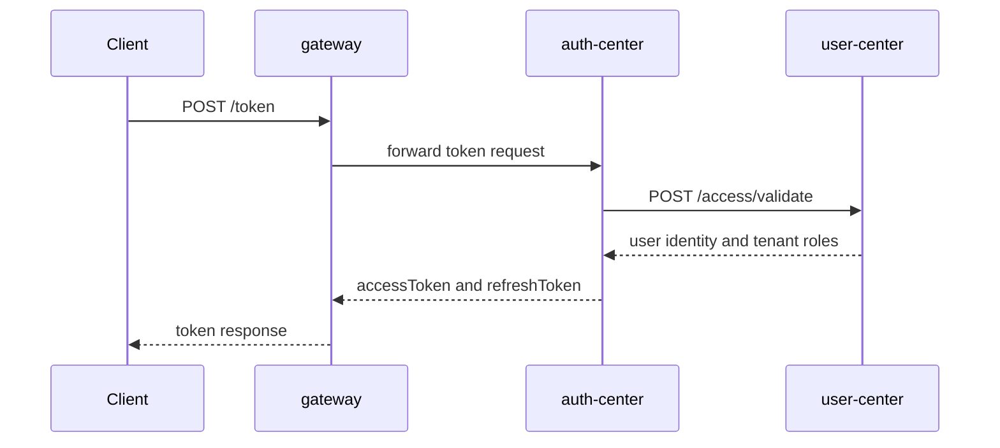
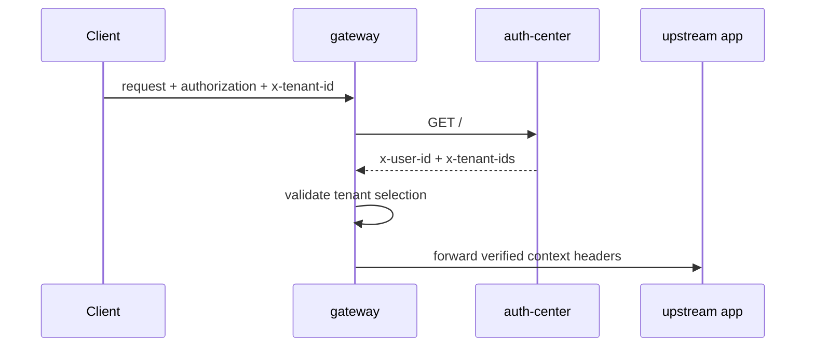

<div align="center">

# Auth Center

### 多租户 SaaS 内核的认证中心

[](https://github.com/ArchAIHarness)
[](https://github.com/ArchAIHarness)
[](LICENSE)

</div>

## 定位

`auth-center` 是 ArchAIHarness 多租户 SaaS 内核的认证中心,负责访问令牌、OAuth 授权码、SSO 登录与身份上下文输出。

它不承载具体业务规则,只提供身份认证、令牌治理、租户权限聚合和网关认证协作能力。

## 核心能力

| 能力 | 说明 |
| --- | --- |
| Token 签发 | 使用 AK/SK 或 OAuth 授权码换取访问令牌 |
| Token 校验 | 为 `gateway` 提供 token introspection 能力 |
| Token 刷新 | 支持访问令牌刷新 |
| OAuth | 提供授权码模式的基础流程 |
| SSO | 对接外部身份提供方并完成登录跳转 |
| 租户上下文 | 返回 `x-user-id`、`x-tenant-ids`、可选 `x-tenant-id` |

## 架构分层

```text
auth-center/
├── common/          # 共享内核,纯 Java 基础类型
├── domain/          # 认证领域模型,无 Spring 依赖
├── application/     # 认证用例编排
├── infrastructure/  # JPA / Feign / Redis / JWT 等技术实现
├── interfaces/      # Controller / Filter / Exception / OpenAPI
└── bootstrap/       # 启动入口与装配
```

当前实现包名为 `top.cloudlab.auth`。作为公开模板复用时,可按组织命名规范迁移包名。

## 核心流程

### Token 签发



### Token 校验



## API

| 方法 | 路径 | 说明 |
| --- | --- | --- |
| GET | `/` | 校验访问令牌 |
| POST | `/token` | AK/SK 创建访问令牌 |
| POST | `/refresh_token` | 刷新访问令牌 |
| GET | `/userinfo` | 获取当前用户信息 |
| POST | `/oauth/authorize` | 生成授权码 |
| POST | `/oauth/access_token` | 授权码或刷新令牌换取访问令牌 |
| GET | `/sso/login` | SSO 登录入口 |

## Header 规范

| Header | 说明 |
| --- | --- |
| `authorization` | Bearer Token |
| `x-user-id` | 当前访问用户 ID |
| `x-tenant-id` | 当前租户 ID |
| `x-tenant-ids` | 用户可访问租户 ID 集合 |
| `x-trace-id` | 链路追踪 ID |

所有上下文 Header 必须使用小写。

## 环境变量

| 变量 | 默认值 | 说明 |
| --- | --- | --- |
| `SERVER_PORT` | `8080` | 服务端口 |
| `DB_URL` | `jdbc:mysql://localhost:3306/auth_center` | 数据库连接地址 |
| `DB_USERNAME` | `auth_center` | 数据库用户名 |
| `DB_PASSWORD` | 空 | 数据库密码 |
| `REDIS_HOST` | `localhost` | Redis 地址 |
| `REDIS_PORT` | `6379` | Redis 端口 |
| `REDIS_PASSWORD` | 空 | Redis 密码 |
| `KAFKA_BOOTSTRAP_SERVERS` | `localhost:9092` | Kafka 地址 |
| `AUTH_SECRET` | 空 | JWT 签名密钥,生产环境必填 |
| `USER_SERVICE_URL` | `http://user:80` | user-center 地址 |
| `LAB_SERVICE_URL` | `https://identity.example.com` | 外部身份提供方地址示例 |

## 快速开始

```bash
mvn clean package
java -jar bootstrap/target/bootstrap-1.0.0-SNAPSHOT.jar
```

## Docker

```bash
docker build -t <registry>/archaiharness/auth-center:latest .
docker push <registry>/archaiharness/auth-center:latest
```

## Kubernetes 示例

```bash
kubectl set image deployment/auth-center auth-center=<registry>/archaiharness/auth-center:latest -n <namespace>
kubectl logs -n <namespace> -l app=auth-center --tail=50 -f
```

## 约束

- `domain` 不依赖 Spring、JPA、Web。
- `application` 不依赖 `infrastructure` 和 `interfaces`。
- `interfaces` 不直接注入 Repository。
- JWT 密钥、数据库密码、Webhook Token 不进入仓库。
- SSO Cookie 写入策略见 `docs/adr/0001-sso-cookie-via-js.md`。

## License

[MIT License](LICENSE)

<div align="center">

—— **Engineered by Architects · Empowered by AI** ——

</div>
