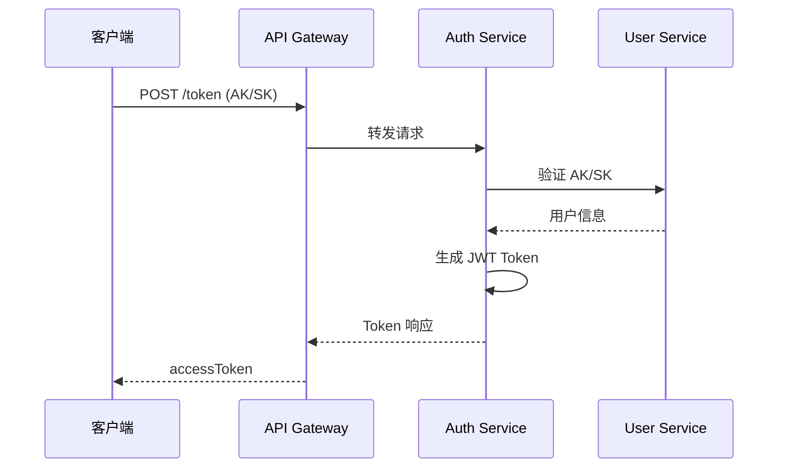
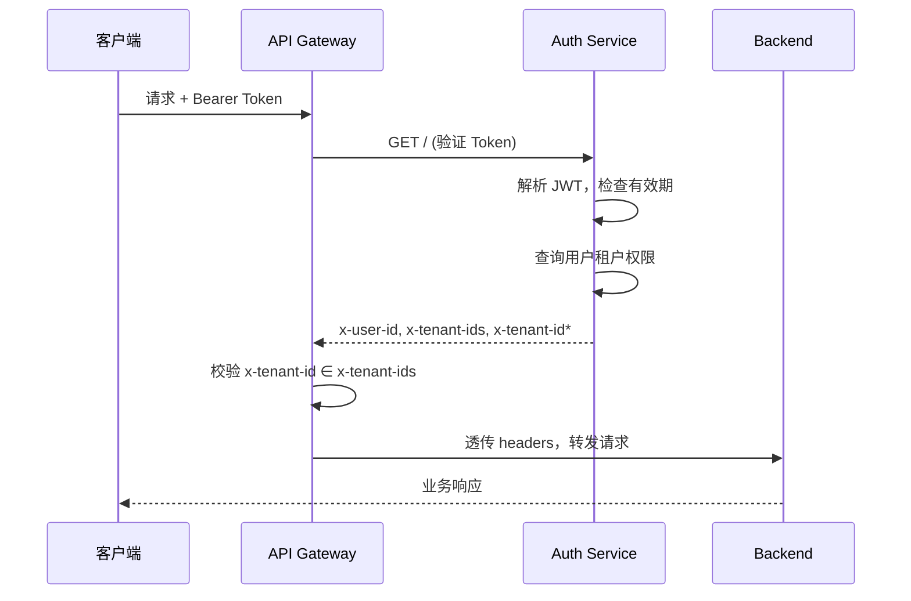
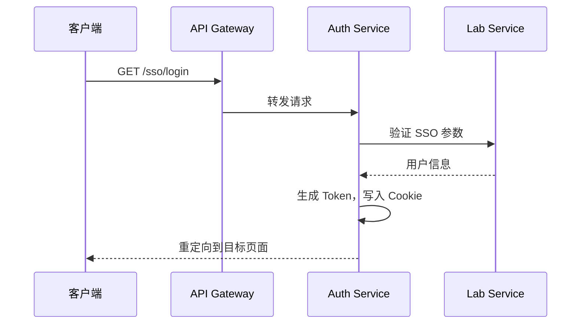
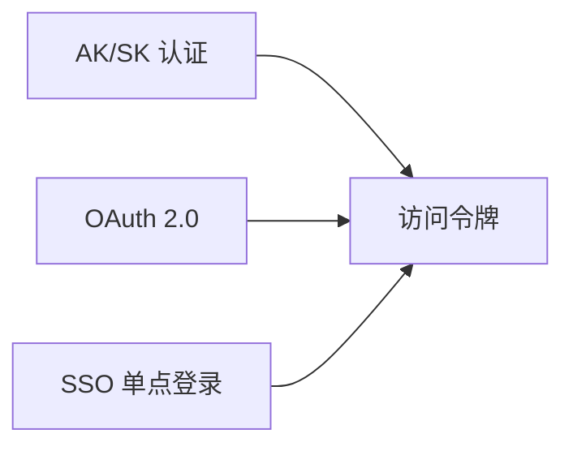

# Auth Center

| 项目 | 内容 |
|------|------|
| **文档版本号** | 1.0.1 |
| **作者** | 云燕平台开发组 |
| **创建时间** | 2026年5月9日 |
| **更新记录** | 2026-05-09 1.0.0：首次创建，记录 auth-center 初始设计方案。<br>2026-05-29 1.0.1：auth 验证接口返回 x-tenant-ids，单租户用户返回 x-tenant-id。<br>2026-05-29 1.0.1：添加 Redis 租户权限缓存（@Cache 注解），AuthController NPE 保护。 |

---

## 设计概述

### 服务定位

- **认证中心**：提供访问令牌管理、OAuth 2.0 授权码流程、SSO 单点登录三大核心能力
- **平台入口**：所有请求的 Token 验证和用户身份认证

### 设计目标

- **安全性**：JWT 签名算法 HMAC-SHA512，令牌安全可靠
- **可扩展性**：支持多租户、多认证方式（AK/SK、OAuth、SSO）
- **高性能**：Token 验证本地缓存，减少远程调用

### 设计思路

- **DDD 分层架构**：common → domain → application → infrastructure → interfaces → bootstrap
- **零框架依赖**：common 层纯 Java，domain 层无 Spring 注解
- **统一响应**：使用 `R<T>` 统一响应格式

---

## 技术栈

| 组件 | 版本 | 用途 |
|------|------|------|
| **Java** | 17 | 运行环境 |
| **Spring Boot** | 3.3.5 | 应用框架 |
| **Spring Cloud** | 2023.0.3 | 微服务生态 |
| **auth0 java-jwt** | 4.4.0 | JWT 编解码 |
| **MySQL** | 8.x | 持久化存储 |
| **Lombok** | 1.18.28 | 代码简化 |

---

## 项目结构

```
auth-center/
├── common/                      # 共享内核，零框架依赖
│   └── top.cloudlab.auth.common.*
├── domain/                      # 领域层，纯 Java
│   └── top.cloudlab.auth.domain.*
├── application/                 # 应用层
│   └── top.cloudlab.auth.application.*
├── infrastructure/              # 基础设施层
│   └── top.cloudlab.auth.infrastructure.*
├── interfaces/                  # 接口层
│   └── top.cloudlab.auth.interfaces.*
└── bootstrap/                   # 启动入口
    └── top.cloudlab.auth.bootstrap.*
```

### 包命名规范

根包名：`top.cloudlab.auth`

---

## 业务流程

### Token 创建流程 (AK/SK)



### Token 验证流程



> * x-tenant-id 仅在用户属于单个租户时返回

### SSO 登录流程



---

## 领域模型

### 核心聚合

| 聚合 | 类型 | 职责 |
|------|------|------|
| **AccessToken** | 聚合根 | 访问令牌，含 JWT 编解码、验证、刷新、撤销 |
| **AuthCode** | 聚合根 | OAuth 授权码，一次性使用，默认有效期 600 秒 |
| **AccessSecret** | 值对象 | AK/SK 对，HMAC-SHA256 签名验证 |

### 值对象

```java
// AK/SK 签名验证
public record AccessSecret(String ak, String sk) {}

// Token 声明
public record TokenClaims(String userId, String tenantId, List<String> scopes) {}
```

---

## 功能设计

### 核心能力



### API 列表

#### 访问认证 (AuthController)

| 方法 | 路径 | 说明 | 响应 Header |
|------|------|------|------------|
| GET | `/` | 验证访问令牌 | x-user-id, x-tenant-ids, x-tenant-id* |
| POST | `/token` | AK/SK 创建访问凭证 | - |
| POST | `/refresh_token` | 刷新访问凭证 | - |
| GET | `/userinfo` | 获取用户身份信息 | - |

> * x-tenant-id 仅在用户属于单个租户时返回

#### OAuth 2.0 (OAuthController)

| 方法 | 路径 | 说明 |
|------|------|------|
| POST | `/oauth/authorize` | 获取用户授权码 |
| POST | `/oauth/access_token` | 授权码/刷新令牌换取访问凭证 |

#### SSO 单点登录 (SSOController)

| 方法 | 路径 | 说明 |
|------|------|------|
| GET | `/sso/login` | 第三方系统单点登录 |

### Header 说明

| Header | 来源 | 说明 |
|--------|------|------|
| x-user-id | auth 验证返回 | 当前访问用户ID |
| x-tenant-id | auth 验证返回（单租户用户） | 当前业务租户ID |
| x-tenant-ids | auth 验证返回 | 用户可访问的租户ID列表（逗号分隔） |

### 请求响应示例

**创建 Token**
```
POST /token
Content-Type: application/json

{
  "ak": "xxx",
  "sk": "xxx",
  "tenantId": "16645192323286622080"
}

响应：
{
  "code": "0",
  "data": {
    "accessToken": "eyJhbGciOiJIUzUxMi...",
    "tokenExpireInSeconds": 7200
  }
}
```

---

## 高可用设计

### 部署配置

- **实例数量**：开发/测试 1 副本，预发/生产至少 2 副本
- **资源配置**：单实例 2 核 2G
- **K8s 探针**：Liveness/Readiness 使用 `/actuator/health`

### 容错机制

- **Token 缓存**：本地缓存减少远程验证
- **降级策略**：验证服务不可用时使用缓存 Token

---

## 环境变量

| 变量 | 默认值 | 说明 |
|------|--------|------|
| **SERVER_PORT** | `8003` | 服务端口 |
| **DB_URL** | `jdbc:mysql://localhost:3306/auth_center` | 数据库连接地址 |
| **DB_NAME** | `cloudlab_auth` | 数据库名 |
| **AUTH_SECRET** | - | JWT 签名密钥（必填） |

---

## 快速开始

### 构建与部署

```bash
# 编译打包（跳过测试覆盖率检查）
mvn clean install -Djacoco.skip=true

# 构建 Docker 镜像
docker build -t localhost:5001/auth-center:latest .

# 推送到 registry
docker push localhost:5001/auth-center:latest

# 部署到 K8s
kubectl set image deployment/auth-center auth-center=localhost:5001/auth-center:latest -n cloudlab
```

### 本地运行

```bash
# 编译
mvn clean compile

# 运行
java -jar bootstrap/target/bootstrap-1.0.0-SNAPSHOT.jar

# API 文档
http://localhost:8003/doc.html
```

---

## 故障排查

```bash
# 查看 Pod 状态和日志
kubectl get pods -n cloudlab -l app=auth-center
kubectl logs -n cloudlab -l app=auth-center --tail=50 -f
```

### 常见问题

| 症状 | 可能原因 |
|------|----------|
| Token 验证失败 | AUTH_SECRET 配置不一致 |
| AK/SK 无效 | User Service 不可用 |
| SSO 登录失败 | Lab Service 参数校验失败 |